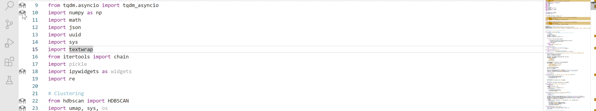
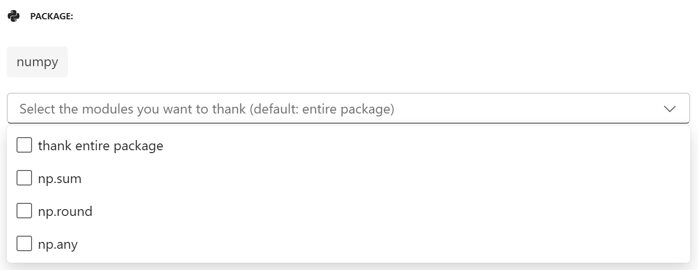
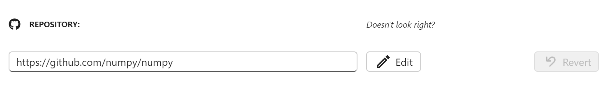
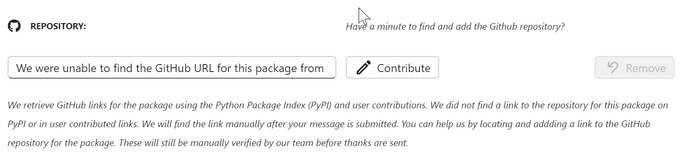

<div align="center">


<a href="https://marketplace.visualstudio.com/items?itemName=hug-reports.hug-reports">
</a>

# Hug Reports

Hug Reports is a Visual Studio Code extension designed to make it easier to express appreciation to contributors of the packages you rely on.

</div>

## Usage

To thank a package you’ve imported into your code file, right click on the 🙌 icon that appears at the start of the line with your import statement. From there, you have the option to select either “Say Thanks” or “Say More”:


### Say Thanks

_Send a token of your appreciation!_
By clicking "Say Thanks", your appreciation will be sent. You have the option to add a personal note by clicking "Say More" or return to your program by clicking "Cancel".

### Say More

_Provide a personalized note to contributors._
Once you click “Say More”, a new webview will appear with a form to fill out:

1. **Package name.** If you have more than one package imported on you line of code, select one to continue with the rest of the form.
2. **Module selection.** You can choose to select specific modules you’ve used in your code, or thank the entire package.
   
3. **Github URL.** This field displays the URL for the repository of the package. You can edit + save the field if modifications are needed.
   
   If the extension cannot find the link to the repository, you can add it yourself by editing the field.
   

4. **Form fields.** Add your note to the relevant prompt! At least one of the text boxes must be filled out to submit the form.
5. **Submit.** Click submit to send your gratitude

## Run The Sample

```bash
# Copy sample extension locally
git clone https://github.com/Hug-Reports/hug-reports-extension.git

# Navigate into sample directory
cd hug-reports-extension

# Install dependencies for both the extension and webview UI source code
npm run install:all

# Build webview UI source code
npm run build:webview

# Open sample in VS Code
code .
```

Once the sample is open inside VS Code you can run the extension by doing the following:

1. Press `F5` to open a new Extension Development Host window
